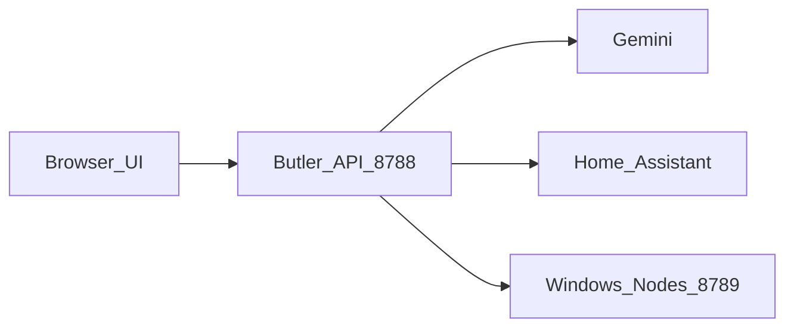

# Antigravity Homelab Butler

**Language / 語言:** [English](README.md) · [繁體中文](README.zh-TW.md)

**One web UI to run your home lab** — Debian host, Windows PCs, Home Assistant, and a Gemini butler you can type or talk to.

[](LICENSE)
[](README.zh-TW.md)
[](#features)

<p align="center">
  
</p>

<p align="center">
  
  &nbsp;
  
</p>

> **Security:** There is **no login by default**. Keep it on a trusted LAN, firewall the port, or put auth in front of it.

## Why this exists

Most homelab stacks are a pile of bookmarks (HA, Portainer, Mesh, SSH…).  
Butler is a **single glass cockpit**: health, containers, LAN probes, files, terminal, cameras — plus an AI that can actually call tools.

## Features

- Web dashboard (`/`), mobile console (`/m`), full chat (`/chat`), voice (`/voice`)
- Home Assistant tools, Zigbee/MQTT awareness, Debian APT helpers
- Windows **Butler Node** probes (`:8789`) for remote files / terminal / VNC links
- Optional MeshCentral / WebRTC remote desktop entry points
- UI: **zh-TW / en** · AI reply language: follow UI or fixed
- Settings page for Gemini key, HA URL/token, languages

## Architecture



## Quick start (Debian / Raspberry Pi)

```bash
cd antigravity-butler
python3 -m venv .venv
source .venv/bin/activate
pip install -r requirements.txt

cp butler_config.example.json butler_config.json
# edit butler_config.json — set gemini_api_key, ha_token, etc.

cp butler_memory.example.json butler_memory.json
cp skills/homelab-architecture.example.md skills/homelab-architecture.md
# optional: cp skills/persona.example.md skills/persona.md

uvicorn butler_api:app --host 0.0.0.0 --port 8788
```

Open `http://<host>:8788/`.

### Environment overrides

| Variable | Purpose |
|----------|---------|
| `GEMINI_API_KEY` | Overrides `gemini_api_key` in config |
| `HA_URL` | Overrides Home Assistant URL |
| `HA_TOKEN` | Overrides HA long-lived token |
| `BUTLER_NODE_TOKEN` | Token expected by Windows probes |

## Windows probe

1. Place `Homelab-ButlerNode-Setup.zip` under `static/downloads/` on the host (not in git).
2. On a LAN PC open `http://<host>:8788/downloads/butler-node`.
3. Run `Install-All.cmd` as Administrator → **Scan LAN** in Node Management.

Source: `butler_node.py` (token must match `node_token` / `BUTLER_NODE_TOKEN`).

## Config files (do not commit secrets)

| File | In git? |
|------|---------|
| `butler_config.example.json` | yes |
| `butler_config.json` | **no** |
| `butler_memory.example.json` | yes |
| `butler_memory.json` | **no** |
| `skills/*.example.md` | yes |
| `skills/homelab-architecture.md` / `persona.md` | **no** |

## UI / AI languages

- Sidebar **中 \| EN** → `assistant.ui_locale`
- Settings → AI reply language: `follow_ui` / `zh-TW` / `en`
- Changing reply language rebuilds the Gemini session

## systemd (example)

```ini
[Unit]
Description=Homelab Butler
After=network.target

[Service]
User=past
WorkingDirectory=/home/past/antigravity-butler
Environment=GEMINI_API_KEY=
ExecStart=/home/past/antigravity-butler/.venv/bin/uvicorn butler_api:app --host 0.0.0.0 --port 8788
Restart=always

[Install]
WantedBy=multi-user.target
```

## Screenshots

| Dashboard | Nodes + AI | Mobile |
|-----------|------------|--------|
|  |  |  |

More: [`docs/screenshots/`](docs/screenshots/)

## License

MIT — see [LICENSE](LICENSE).
