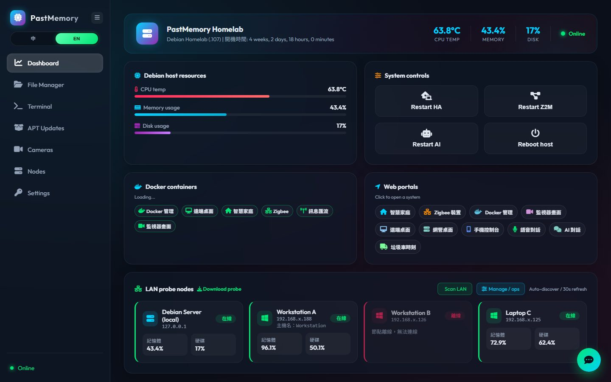
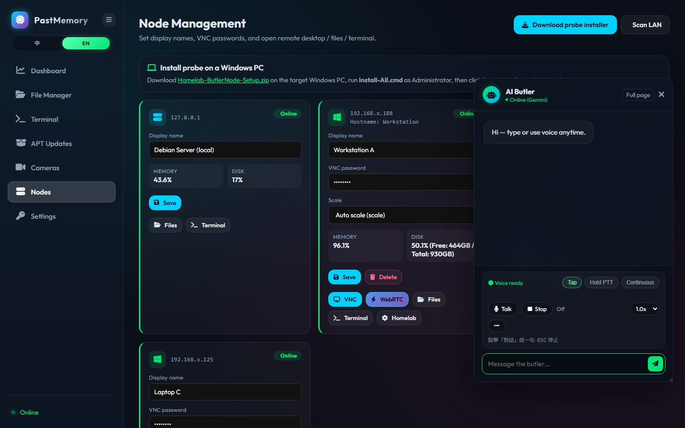
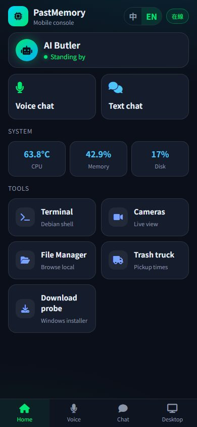
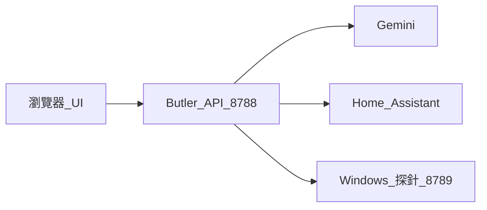

# Antigravity Homelab Butler

**Language / 語言:** [English](README.md) · [繁體中文](README.zh-TW.md)

**一個網頁管你的 Homelab** — Debian 主機、Windows 電腦、Home Assistant，加上能打字／語音使喚的 Gemini 管家。

[](LICENSE)
[](README.md)
[](#功能)

<p align="center">
  
</p>

<p align="center">
  
  &nbsp;
  
</p>

> **安全：** 預設**沒有登入**。請放在可信區網、用防火牆限制，或在前面加認證。

## 為什麼做這個

Homelab 常常是一堆書籤（HA、Portainer、Mesh、SSH…）。  
Butler 想當**一塊玻璃座艙**：健康狀態、容器、區網探針、檔案、終端、攝影機，再加上真的會呼叫工具的 AI。

## 功能

- 網頁儀表板（`/`）、手機控制台（`/m`）、完整對話（`/chat`）、語音（`/voice`）
- Home Assistant 工具、Zigbee／MQTT 感知、Debian APT 輔助
- Windows **Butler Node** 探針（`:8789`）遠端檔案／終端／VNC
- 可選 MeshCentral／WebRTC 遠端桌面入口
- 介面：**zh-TW / en** · AI 回覆可跟隨介面或固定
- 系統設定頁：Gemini Key、HA URL／Token、語言

## 架構



## 快速開始（Debian／Raspberry Pi）

```bash
cd antigravity-butler
python3 -m venv .venv
source .venv/bin/activate
pip install -r requirements.txt

cp butler_config.example.json butler_config.json
# 編輯 butler_config.json — 填入 gemini_api_key、ha_token 等

cp butler_memory.example.json butler_memory.json
cp skills/homelab-architecture.example.md skills/homelab-architecture.md
# 可選：cp skills/persona.example.md skills/persona.md

uvicorn butler_api:app --host 0.0.0.0 --port 8788
```

開啟 `http://<主機>:8788/`。

### 環境變數覆寫

| 變數 | 用途 |
|------|------|
| `GEMINI_API_KEY` | 覆寫設定檔 `gemini_api_key` |
| `HA_URL` | 覆寫 Home Assistant URL |
| `HA_TOKEN` | 覆寫 HA long-lived token |
| `BUTLER_NODE_TOKEN` | Windows 探針驗證 token |

## Windows 探針

1. 主機放置 `Homelab-ButlerNode-Setup.zip` 到 `static/downloads/`（不進 git）
2. 區網電腦開啟 `http://<主機>:8788/downloads/butler-node`
3. 系統管理員執行 `Install-All.cmd` → 節點管理按**掃描區網**

原始碼：`butler_node.py`（token 須與 `node_token`／`BUTLER_NODE_TOKEN` 一致）

## 設定檔（請勿提交密鑰）

| 檔案 | 是否進 git |
|------|------------|
| `butler_config.example.json` | 是 |
| `butler_config.json` | **否** |
| `butler_memory.example.json` | 是 |
| `butler_memory.json` | **否** |
| `skills/*.example.md` | 是 |
| `skills/homelab-architecture.md`／`persona.md` | **否** |

## 介面／AI 語言

- 側欄 **中 \| EN** → `assistant.ui_locale`
- 系統設定 → AI 回覆語言：`follow_ui`／`zh-TW`／`en`
- 變更回覆語言會重建 Gemini session

## systemd 範例

```ini
[Unit]
Description=Homelab Butler
After=network.target

[Service]
User=past
WorkingDirectory=/home/past/antigravity-butler
Environment=GEMINI_API_KEY=
ExecStart=/home/past/antigravity-butler/.venv/bin/uvicorn butler_api:app --host 0.0.0.0 --port 8788
Restart=always

[Install]
WantedBy=multi-user.target
```

## 截圖

| 儀表板 | 節點 + AI | 手機 |
|--------|-----------|------|
|  |  |  |

更多：[`docs/screenshots/`](docs/screenshots/)

## 授權

MIT — 見 [LICENSE](LICENSE)。
